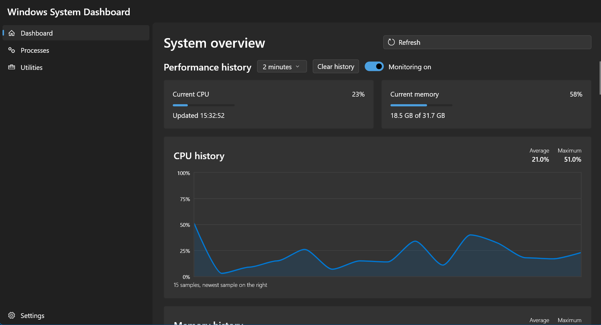
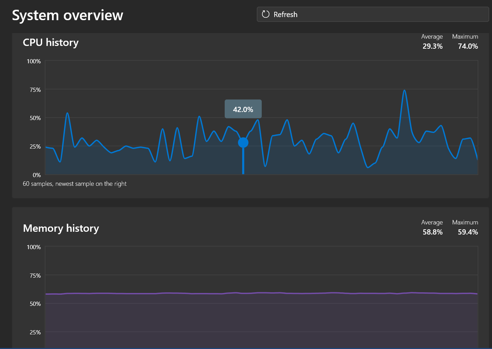
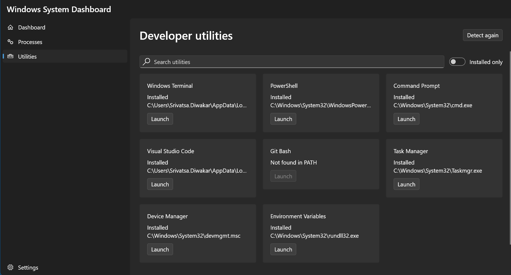

# Windows System Dashboard

A modern Windows desktop dashboard built with Flutter for monitoring system performance, exploring running processes, detecting developer tools, and quickly finding useful Windows utilities.

[View Repository](https://github.com/Vatsa0408/flutter_windows_system_dashboard) | [Report an Issue](https://github.com/Vatsa0408/flutter_windows_system_dashboard/issues) | [Request a Feature](https://github.com/Vatsa0408/flutter_windows_system_dashboard/issues/new)

## **Overview**

Windows System Dashboard brings commonly used system information and developer-focused utilities into one clean desktop application. It is designed as both a practical Windows companion and a portfolio project demonstrating Flutter desktop development, real-time monitoring, native operating-system integration, and feature-based application architecture.

## Highlights

- Real-time CPU and memory monitoring
- Historical performance charts
- Running-process discovery and inspection
- Installed developer-tool detection
- Fast utility search
- Windows-focused desktop interface
- Modular, feature-based Flutter codebase
- Responsive dashboard layout

## Features

### System Overview
View important system information from a single dashboard instead of switching between multiple Windows tools.

### Real-Time Performance Monitoring
Track current CPU and memory usage through live dashboard indicators.

### Historical Performance Charts
Observe recent performance trends and understand how system resource usage changes over time.

### Process Explorer
Discover running processes and inspect useful process information from inside the application.

### Developer Tools Detection
Quickly identify installed development tools and verify whether commonly used tools are available on the machine.

### Utility Search
Search for useful Windows utilities and launch or access them more efficiently.

## Screenshots

Screenshots will make the project easier to understand at a glance. Add images to `docs/screenshots/`, then replace the examples below with your actual files.

```html
<p align="center">
  
</p>

<p align="center">
  
  
</p>
```

## Technology

- [Flutter](https://flutter.dev/) for the desktop user interface
- [Dart](https://dart.dev/) as the application language
- [Visual Studio Code](https://code.visualstudio.com/) for development
- Windows desktop APIs and system commands for operating-system information

## Project Structure

```text
lib/
├── core/                # Shared services, helpers, and application-wide code
├── features/            # Feature-focused modules
│   ├── dashboard/       # System overview and live metrics
│   ├── performance/     # Historical monitoring and charts
│   ├── processes/       # Running-process discovery
│   ├── developer_tools/ # Installed developer-tool detection
│   └── utilities/       # Utility search and related actions
├── shared/              # Reusable widgets and models
└── main.dart             # Application entry point
```

> The exact folder names may evolve as the project grows. See the [`lib`](https://github.com/Vatsa0408/flutter_windows_system_dashboard/tree/main/lib) directory for the current implementation.

## Getting Started

### Prerequisites

Before running the project, install:

1. [Flutter SDK](https://docs.flutter.dev/get-started/install/windows/desktop)
2. [Git](https://git-scm.com/download/win)
3. [Visual Studio](https://visualstudio.microsoft.com/downloads/) with the **Desktop development with C++** workload
4. A code editor such as [Visual Studio Code](https://code.visualstudio.com/)

Verify the Flutter Windows setup:

```powershell
flutter doctor
flutter config --enable-windows-desktop
```

### Installation

Clone the repository:

```powershell
git clone https://github.com/Vatsa0408/flutter_windows_system_dashboard.git
cd flutter_windows_system_dashboard
```

Install dependencies:

```powershell
flutter pub get
```

Run the application:

```powershell
flutter run -d windows
```

## Build a Windows Release

Create a release build with:

```powershell
flutter build windows --release
```

The generated application will be available under:

```text
build/windows/x64/runner/Release/
```

## Development

Run static analysis:

```powershell
flutter analyze
```

Run the test suite:

```powershell
flutter test
```

Format the Dart source code:

```powershell
dart format lib test
```

## Roadmap

- [x] Windows desktop dashboard foundation
- [x] Real-time CPU and memory monitoring
- [x] Installed developer-tools detection
- [x] Utility search
- [x] Historical performance charts
- [x] Running-process discovery
- [ ] Disk and network monitoring
- [ ] Configurable dashboard widgets
- [ ] Performance alerts and thresholds
- [ ] Data export for historical metrics
- [ ] Light and dark theme preferences
- [ ] Packaged Windows installer

## Contributing

Contributions, suggestions, and bug reports are welcome.

1. Fork the repository.
2. Create a feature branch:

   ```powershell
   git checkout -b feature/your-feature-name
   ```

3. Commit your changes:

   ```powershell
   git commit -m "Add your feature"
   ```

4. Push the branch:

   ```powershell
   git push origin feature/your-feature-name
   ```

5. Open a pull request.

Please keep changes focused, run `flutter analyze` and `flutter test`, and include screenshots when modifying the user interface.

## Known Limitations

- The application is designed primarily for Windows desktop.
- Some system information may depend on Windows commands, permissions, or APIs available on the host machine.
- Metrics can vary slightly from Windows Task Manager because tools may use different sampling intervals and calculation methods.

## License

This project is distributed under the [MIT License](LICENSE).

## Author

Developed by [Srivatsa Diwakar](https://github.com/Vatsa0408).

If you find this project useful, consider starring the repository. Feedback and feature suggestions are always welcome.
